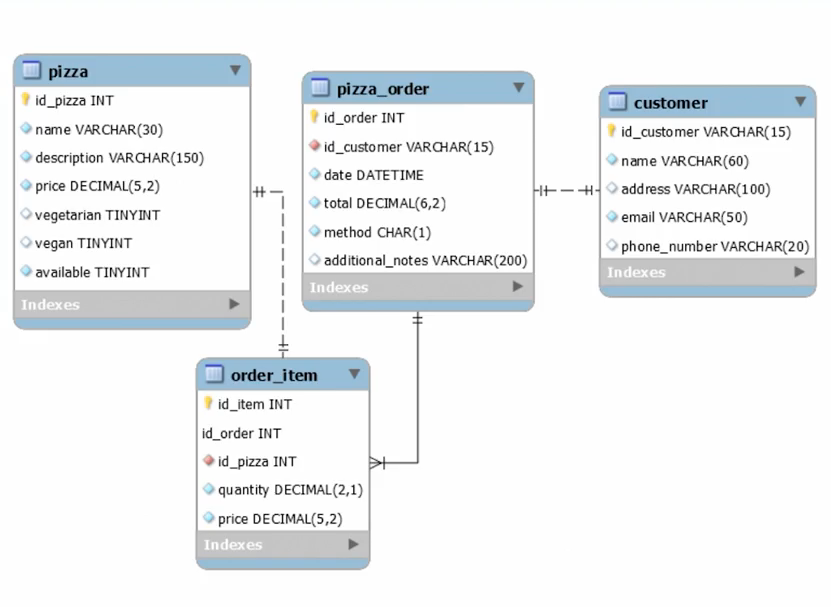

## Rest API | Pizza Shop | Spring Boot
### Technology used
* `Spring Web`
* `Spring Data JPA`
* `MySQL`
* `Lombok`
### Project description
This project is part of platzi course "Curso de Java Spring Data JPA: Bases de Datos". Rest API with Spring for pizza shop.
<br>
Entities:<br>
`customer`<br>
`pizza`<br>
`pizza_order`<br>
`order_item`<br>

### BD diagram



### Configuration
- Create `launch.json` file. In `Run` > `Add Configuration` > `Java`
```
    {
      "type": "java",
      "name": "PizzeriaApplication",
      "request": "launch",
      "mainClass": "com.pizzeria.PizzeriaApplication",
      "projectName": "pizzeria",
      "env": {
        "DB_URL": "jdbc:mysql://localhost:3306/pizzeria?createDatabaseIfNotExist=true",
        "DB_USERNAME": "username",
      }
    }
```